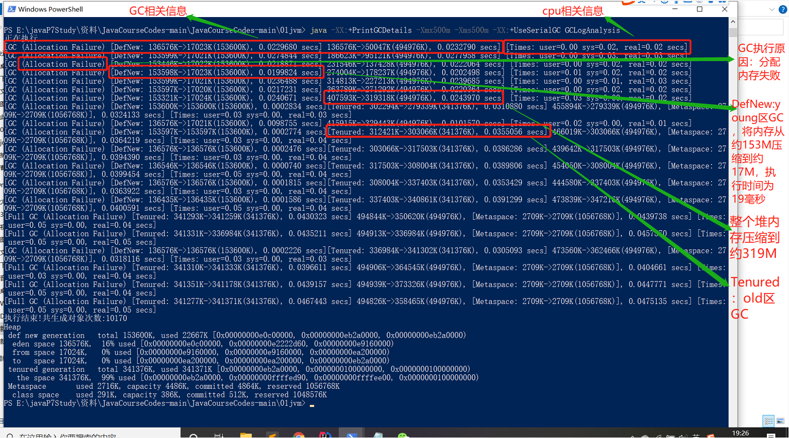
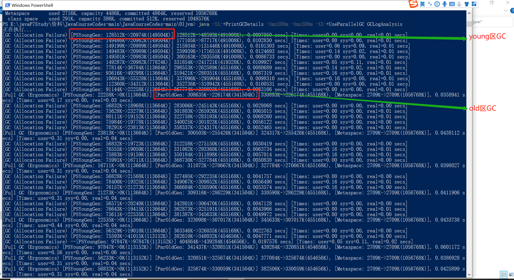
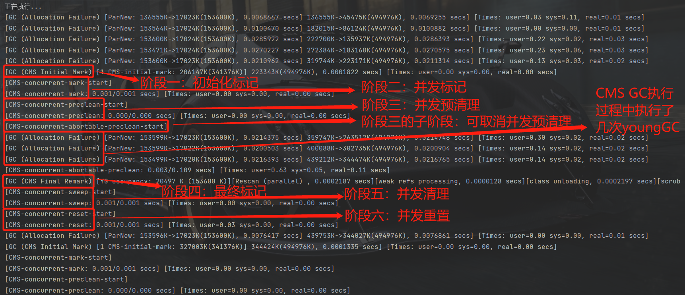
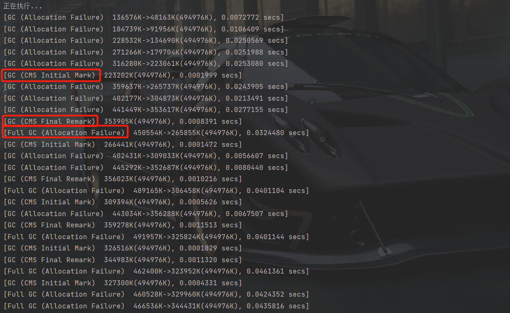
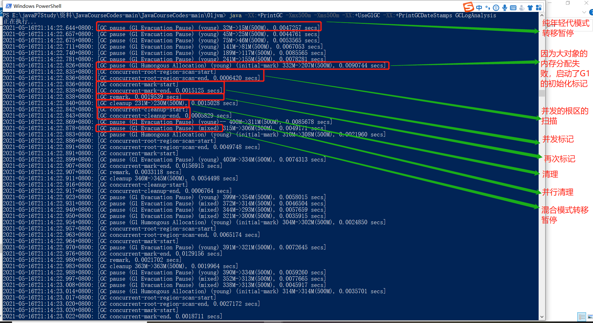
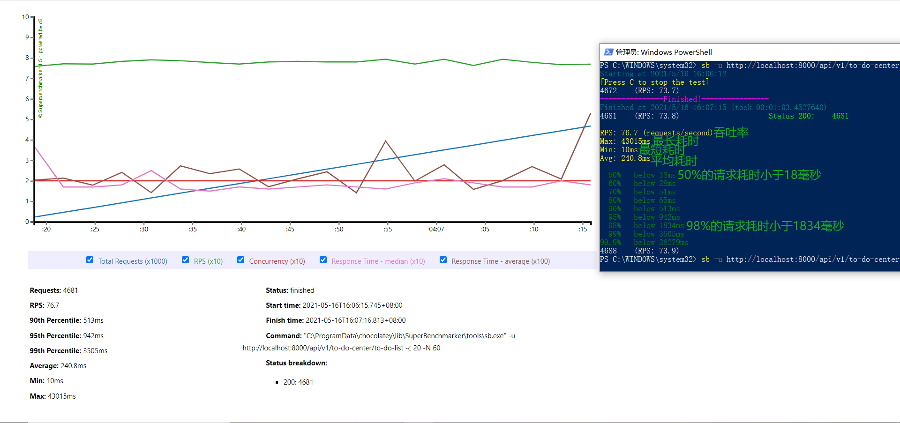

# 对于不同GC的总结

## 串行GC

> 启动参数： -XX:+PrintGCDetails -Xmx500m -Xms500m -XX:+UseSerialGC

## 并行GC

> 启动参数： -XX:+PrintGCDetails -Xmx500m -Xms500m -XX:+UseParallelGC

## CMSGC

> 启动参数：-XX:+PrintGCDetails -Xmx500m -Xms500m -XX:+UseConcMarkSweepGC

> 将启动参数：-XX:+PrintGCDetails 换成 -XX:+PrintGC， GC日志中只展示了CMS GC的初始化标记阶段和最终标记阶段，并发清理和并发重置阶段以full GC的形式展示

## G1GC

> 启动参数：-XX:+PrintGC -Xmx500m -Xms500m -XX:+UseG1GC -XX:+PrintGCDateStamps

## 压测工具 SuperBenchmarker（sb） 的使用

